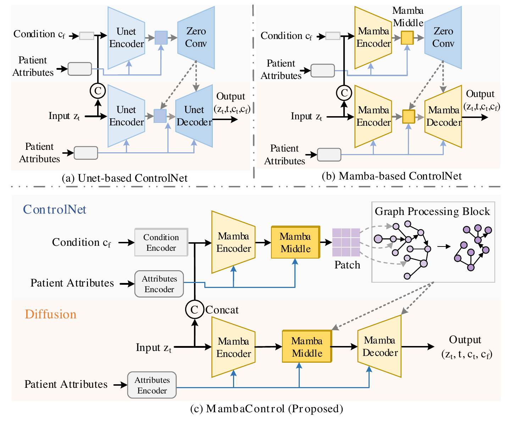
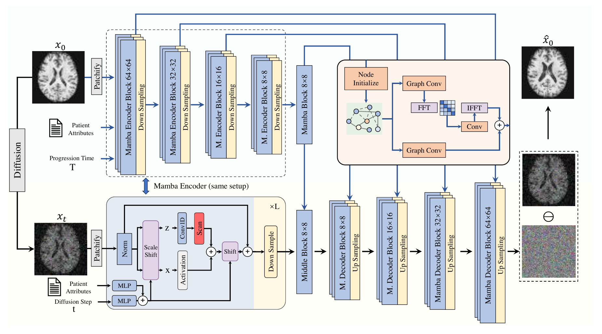
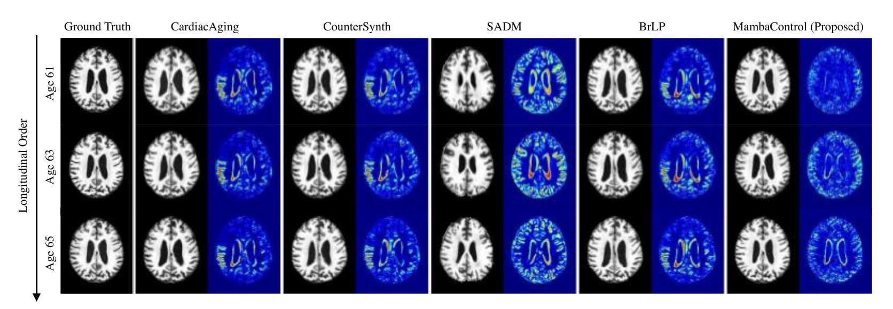

# MambaControl

**Anatomy Graph-Enhanced Mamba ControlNet with Fourier Refinement for Diffusion-Based Disease Trajectory Prediction** — IEEE SMC 2025.

[](https://ieeexplore.ieee.org/document/11343720/)
[](https://doi.org/10.1109/SMC58881.2025.11343720)
[](LICENSE)

📄 **Paper:** <https://ieeexplore.ieee.org/document/11343720/>

Given a **baseline 3D brain MRI** and a **target time** Δt, MambaControl predicts the subject's
**follow-up scan**. Generation happens in the latent space of a MAISI autoencoder: a Mamba-based
latent diffusion model produces the follow-up latent, a Mamba ControlNet steers it with the
baseline scan and subject covariates, and the result is decoded back to image space.

Conditioning uses only information available at inference time (baseline scan, baseline-derived
covariates, and the query interval Δt) — **no follow-up information leaks into the prediction**.

<p align="center">
  
</p>
<p align="center"><em>Design comparison: (a) UNet ControlNet, (b) Mamba ControlNet,
(c) MambaControl — a Mamba control pathway with an anatomy graph block.</em></p>

## Method

<p align="center">
  
</p>
<p align="center"><em>Full architecture from the paper. The <strong>Graph Processing Block
(Node Initialize → Graph Conv → FFT/IFFT)</strong> is the Fourier anatomy-graph module, which is
<strong>not included in this release</strong> — see
<a href="#results">What this release contains</a>.</em></p>

| component | where |
|---|---|
| Mamba latent diffusion UNet (selective state-space denoiser, ε-prediction) | `mambacontrol/mamba.py` |
| Mamba ControlNet (separate control pathway, zero-init injection into the diffusion pathway) | `mambacontrol/control_mamba.py` |
| MAISI 3D autoencoder (image ↔ latent) | `mambacontrol/autoencoder/` |
| DDIM / SDEdit samplers and inferers | `mambacontrol/sampling.py`, `mambacontrol/inferers.py` |

At inference the baseline latent is noised to `t_start` and re-denoised (SDEdit) under the
ControlNet condition `[baseline_latent, Δt]` plus an 8-dim covariate vector injected by
cross-attention, then blended back toward the baseline (see [Inference](#5-inference)).

## Repository layout

```
mambacontrol/                  core library (Mamba UNet, Mamba ControlNet, MAISI AE, samplers, const)
scripts/prepare/
  prepare_csv.py               build the single-visit (A) and pairs (B) CSVs from a raw manifest
  extract_latents.py           encode every scan to a latent  -> <scan>_new_latent.npz
scripts/training/
  train_autoencoder.py         stage 1 — MAISI autoencoder
  train_diffusion_mamba.py     stage 2 — Mamba latent diffusion
  train_control_mamba.py       stage 3 — Mamba ControlNet (progression)
  train_aux.py                 optional auxiliary disease-course priors
train_residual_regression.py   latent residual-regression variant (see Variants)
predict_followup.py            inference: baseline + Δt -> predicted follow-up
evaluate_ae.py                 stage-1 check: AE reconstruction PSNR / SSIM / MAE
eval_final.py                  operating-point sweep (t_start × steps × alpha) vs the copy floor
eval_changemetric.py           direction-aware change metrics (CHANGE_PCC / DICE / MAE)
resreg_eval.py                 eval for the residual-regression variant
test.py                        full test-set pass with volume dumps / visualisations
run/                           SLURM launchers, one per stage
```

## 1. Installation

Requires Linux + an NVIDIA GPU (the Mamba kernels are CUDA-only), Python ≥ 3.10, and a CUDA
toolchain (`nvcc`) matching your PyTorch build.

```bash
conda create -n mambacontrol python=3.10 -y
conda activate mambacontrol

# 1) PyTorch first, matched to your CUDA version
pip install torch torchvision --index-url https://download.pytorch.org/whl/cu121

# 2) everything else
pip install -r requirements.txt

# 3) Mamba kernels (must be built against the installed torch)
pip install causal-conv1d>=1.4.0 --no-build-isolation
pip install mamba-ssm>=2.2.2     --no-build-isolation
```

Sanity check:

```bash
python -c "import torch, monai, mamba_ssm; print(torch.__version__, monai.__version__, torch.cuda.is_available())"
python -c "from mambacontrol import networks, const; print(const.INPUT_SHAPE_AE)"   # (120, 144, 120)
```

Run every command from the repository root so that `mambacontrol/` is importable. The SLURM
launchers in `run/` activate `$CONDA_ENV` (default `progression`) — set it to your env name.

## 2. Data

**Images** — `.nii.gz`, skull-stripped, 1.5 mm isotropic, rigidly registered to the subject's
baseline, cropped/padded to `const.INPUT_SHAPE_AE = (120, 144, 120)`, intensities scaled to
`[0, 1]`. Segmentations (used only to derive regional volumes) follow the SynthSeg label map in
`mambacontrol/const.py`.

**Manifest CSV** — one row per scan, with at least:

| column | meaning |
|---|---|
| `image_uid`, `subject_id` | scan / subject identifiers |
| `image_path`, `segm_path` | paths to the preprocessed volume and its segmentation |
| `age`, `sex`, `diagnosis` | demographics at that visit |
| `last_diagnosis`, `follow_up` | final diagnosis; months since the subject's first scan |
| `split` | `train` / `valid` / `test`, assigned **per subject** |

Build the derived CSVs (A = per-visit with normalised regional volumes, B = baseline/follow-up
pairs with `starting_*` / `followup_*` columns):

```bash
python scripts/prepare/prepare_csv.py \
    --dataset_csv    /path/to/manifest.csv \
    --output_path    /path/to/csv_out \
    --coarse_regions /path/to/coarse_regions.csv
```

`Δt` is derived from the pair as `(followup_follow_up − starting_follow_up) / 12` years.
The 8-dim conditioning vector is
`[followup_age, sex, starting_diagnosis, starting_cerebral_cortex, starting_hippocampus,
starting_amygdala, starting_cerebral_white_matter, starting_lateral_ventricle]`.

**Latents** — `<scan>_new_latent.npz`, key `data`, shape `(4, 30, 36, 30)`. A per-dataset
`scale_factor = 1/std(latent)` is applied before the network and removed before decoding.

## 3. Training

Each stage has a SLURM launcher under `run/` — edit the paths in the `# ---- config (EDIT) ----`
block and `sbatch` it, or run the underlying command directly.

> The full command sequence, with the verified hyper-parameters and evaluation rules, is
> in **[RECIPE.md](RECIPE.md)**.

**Stage 1 — autoencoder** (`run/1_train_autoencoder.sh`)

```bash
python scripts/training/train_autoencoder.py \
    --dataset_csv A.csv --cache_dir <cache> --output_dir <out_ae> \
    --n_epochs 50 --batch_size 2 --lr 1e-4 --num_workers 8 --gpus 0
```

**Stage 2 — encode all scans to latents** (`run/2_extract_latents.sh`)

```bash
python scripts/prepare/extract_latents.py \
    --dataset_csv A.csv --aekl_ckpt <out_ae>/autoencoder-ep-N.pth --gpus 0
```

**Stage 3 — Mamba latent diffusion** (`run/3_train_diffusion.sh`)

```bash
python scripts/training/train_diffusion_mamba.py \
    --dataset_csv A.csv --cache_dir <cache> --output_dir <out_diff> \
    --aekl_ckpt <ae.pth> --n_epochs 100 --batch_size 8 --lr 2.5e-5 --gpus 0
```

**Stage 4 — Mamba ControlNet** (`run/4_train_controlnet.sh`) — needs the **pairs** CSV:

```bash
python scripts/training/train_control_mamba.py \
    --dataset_csv B.csv --cache_dir <cache> --output_dir <out_cnet> \
    --aekl_ckpt <ae.pth> --diff_ckpt <out_diff>/unet-ep-99.pth \
    --n_epochs 100 --batch_size 2 --lr 2.5e-5 --gpus 0
```

Training uses AdamW (lr 1e-4 for the AE, 2.5e-5 for diffusion/ControlNet), weight decay 0.01,
gradient clipping at norm 2.0, and bf16 mixed precision (`ACCELERATE_MIXED_PRECISION=bf16`).
Checkpoints are written every epoch; only the most recent few are kept.

## 4. Testing / evaluation

**Autoencoder reconstruction** (run this first — everything downstream is bounded by it):

```bash
python evaluate_ae.py --ckpt <ae.pth> --csv A.csv --n 32 --out ae_eval.json
```

**Operating-point sweep + change metrics** (`run/eval.sh`):

```bash
T_STARTS=150,200,250 STEPS_LIST=25,50,100 ALPHAS=0.05,0.10,0.15 N=20 \
    python eval_final.py <out_cnet>/cnet-ep-99.pth      # PSNR/SSIM vs the copy floor
python eval_changemetric.py                             # CHANGE_PCC / CHANGE_DICE / CHANGE_MAE
```

**Full test pass** with saved volumes and side-by-side images:

```bash
python test.py --dataset_csv B.csv --cache_dir <cache> --output_dir <out> \
    --aekl_ckpt <ae.pth> --diff_ckpt <unet.pth> --cnet_ckpt <cnet.pth> \
    --save --save_dir test_results --gpus 0
```

Always report **n ≥ 64** pairs: per-case scores on this task are very noisy and small-n rankings
are not reliable.

## 5. Inference

```bash
# predict a follow-up from a baseline latent and a target interval
python predict_followup.py --start_latent BASELINE_new_latent.npz --delta_t_years 2.0 --out pred.npy

# or score held-out pairs from the pairs CSV
python predict_followup.py --row 0
```

The default operating point is set at the top of `predict_followup.py`:
`t_start = 200`, `steps = 100`, and a conservative blend
`followup = baseline + α · (prediction − baseline)` with `α = 0.10`.
Checkpoint paths are read from `MC_AE_CKPT` / `MC_UNET_CKPT` / `MC_CNET_CKPT`.

## Configuration

Nothing in the repo hard-codes a machine: paths default to repo-relative placeholders
(`data/scans.csv`, `data/pairs.csv`, `checkpoints/*.pth`) and are overridden with the variables
below. The `run/*.sh` launchers read `DATA`, `OUT`, `AE_CKPT`, `DIFF_CKPT`, `CNET_CKPT`,
`CONDA_BASE`, `CONDA_ENV`, and need their `#SBATCH --partition` line edited for your cluster.

| variable | used by | meaning |
|---|---|---|
| `AD_PROGRESSION_ROOT` | trainers, eval | dataset root prepended to relative image paths |
| `MC_LATENT_SUFFIX` | training / eval | latent filename suffix (default `_new_latent.npz`) |
| `MAISI_LATENT_LAYOUT` | trainers | `sibling` (default) or `ssd` latent file layout |
| `MC_EVAL_DATA` | eval scripts | directory holding `final_loader.py` / `eval_common.py` |
| `MC_NOCACHE=1` | residual regressor | use a plain, non-caching `Dataset` |
| `MC_AE_CKPT`, `MC_UNET_CKPT`, `MC_CNET_CKPT` | inference + eval | checkpoint paths (override the in-file defaults) |
| `MC_PAIRS_CSV`, `MC_AE_CSV` | inference + eval | pairs CSV / single-visit CSV |
| `ACCELERATE_MIXED_PRECISION=bf16` | all training | mixed precision |

## Results

Reported on the ADNI-3 longitudinal cohort (subjects with ≥ 2 imaging sessions and complete
demographics, split 7:1:2 by subject), trained on 2× NVIDIA V100 32 GB.

<p align="center">
  
</p>
<p align="center"><em>Qualitative comparison over one subject's longitudinal series (ages 61 → 65),
against CardiacAging, CounterSynth, SADM and BrLP. Each method shows its prediction and the
corresponding error map. Reproduced from the paper, i.e. the full model including the
Fourier anatomy-graph module.</em></p>

| | PSNR (dB) ↑ | SSIM (%) ↑ | hippocampus MAE ↓ |
|---|---|---|---|
| MambaControl (diffusion + control only) | 28.37 ± 1.70 | 92.01 ± 1.29 | 0.029 ± 0.030 |
| **MambaControl (+ Fourier anatomy graph)** | **29.72 ± 1.04** | **93.60 ± 0.96** | **0.018 ± 0.014** |

State of the art on this benchmark with 215.5 M generator parameters. Regional MAE is also
reported for amygdala, lateral ventricles, thalamus and CSF; see Table I and the ablation in
Section IV-B of the paper for the full comparison against published baselines.

> **What this release contains.** The code published here is the Mamba latent-diffusion +
> Mamba ControlNet backbone — the first row of the table. The Fourier-enhanced anatomy-graph
> module that produces the second row is **not part of this release**; reproducing the bolded
> numbers requires that component. The numbers above are quoted from the paper, not regenerated
> from this repository.

## Variants

`train_residual_regression.py` / `resreg_eval.py` implement a non-generative ablation: a UNet
takes `[baseline_latent (4ch), Δt plane (1ch)]` plus the 8-dim covariates and regresses the
**latent residual** `followup_latent − baseline_latent` under an L1 loss, with
`prediction = decode(baseline_latent + net(...))`. It optimises the change directly instead of
sampling a plausible follow-up, which trades image realism for a better-aligned change field.

```bash
MC_LATENT_SUFFIX=_new_latent.npz MC_NOCACHE=1 python train_residual_regression.py \
    --dataset_csv B.csv --cache_dir <cache> --output_dir <out_resreg> \
    --aekl_ckpt <ae.pth> --n_epochs 60 --batch_size 8 --gpus 0

MC_LATENT_SUFFIX=_new_latent.npz python resreg_eval.py \
    --ckpt <out_resreg>/resreg-ep-N.pth --aekl_ckpt <ae.pth> --num 64 --gpu 0
```

## Notes and caveats

- **Score on the native 120×144×120 grid.** `decode(latent)` lives on the autoencoder's FOV;
  scoring on a padded 128³ grid penalises a border the latent pipeline cannot produce. Voxel-space
  methods are FOV-insensitive, so this is a fairness fix, not a crop trick.
- **Copy is a strong floor.** The real follow-up-versus-baseline change is a small fraction of
  the intensity range, comparable to the autoencoder's reconstruction error, so simply copying the
  baseline scan already scores near-optimal PSNR and raw PSNR barely separates methods.
  Direction-aware change metrics (`eval_changemetric.py`) are the informative lens.
- **Latent shapes are not interchangeable.** `(4,30,36,30)` sibling latents (120³ FOV) and
  `(4,32,36,32)` latents (128³ FOV) come from the same weights but different crops; mixing them
  silently degrades everything.
- MetaTensor latents are stripped with `.as_tensor()` inside the training loop — without it,
  cross-attention allocates tens of GB.

## Citation

Paper: <https://ieeexplore.ieee.org/document/11343720/>

```bibtex
@inproceedings{yang2025mambacontrol,
  title     = {MambaControl: Anatomy Graph-Enhanced Mamba ControlNet with Fourier
               Refinement for Diffusion-Based Disease Trajectory Prediction},
  author    = {Yang, Hao and Tan, Tao and Tan, Shuai and Yang, Weiqin and
               Cai, Kunyan and Chen, Calvin and Sun, Yue},
  booktitle = {2025 IEEE International Conference on Systems, Man, and Cybernetics (SMC)},
  pages     = {4423--4428},
  year      = {2025},
  publisher = {IEEE},
  doi       = {10.1109/SMC58881.2025.11343720}
}
```

## License

Released under the Apache License 2.0 — see [LICENSE](LICENSE). Portions derive from
Apache-2.0-licensed upstream projects (see Acknowledgements); their notices are retained in the
corresponding source files.

## Acknowledgements

The 3D autoencoder is built on **MAISI** (MONAI Generative Models). The latent
disease-progression training scaffolding derives from the open-source Brain Latent Progression
codebase (Puglisi et al., MICCAI 2024 / *Medical Image Analysis* 2025); please honour its licence
terms when redistributing. Data were obtained from the Alzheimer's Disease Neuroimaging
Initiative (ADNI).
